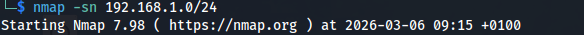
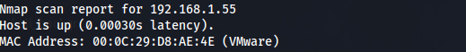
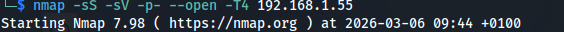
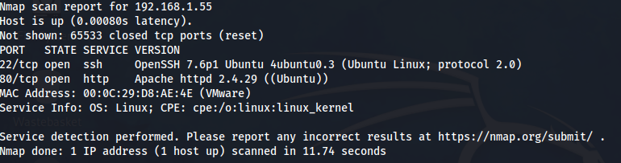
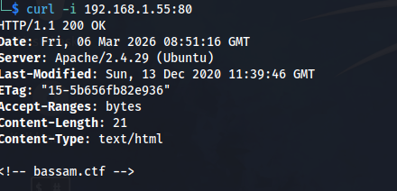
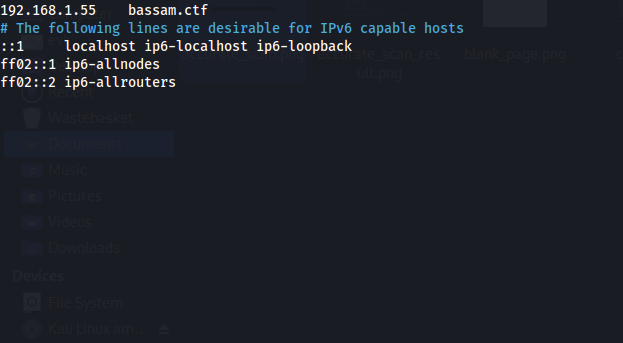

# Cybersecurity Portfolio
## Bassam CTF writeup - Local Network

After downloading and opening the box from vulnhub : https://www.vulnhub.com/entry/bassamctf-1,631/, we launch it in VMware and log into our main machine.

First things first, we open our cmd and start with a ping sweep to get an idea of who is alive on our network without causing too much network noise.
```
nmap -sn 192.168.1.0/24
```  

  
As the target machine is on the local network, it is easy to identify, thanks to also the host name being "VMWare"  
Here we acquire the important information that our target is located at the IP: 192.168.1.55.  
  
  

Finally we can run a more targeted scan on the target IP.
  
```
nmap -sS -sV -p- -T4 --open 192.168.1.55
```

This nmap scan shows which ports are open and which services/versions are running on these ports.
  
 

The ports that are open are only two, and the services running on the target machine are:
 - 22 SSH OpenSSH 7.6p1 Ubuntu
 - 80 http Apache httpd 2.4.29
Immediately from the result of the scan we can have an idea of the enumeration and possible exploitation approach.
There will be some sort of web application, through which we will hopefully be able to gain credentials to either bruteforce or normally login into SSH.

Before opening the browser and going into the target's website, I decide to curl the address to see headers and hidden fields the browser would not normally show.  

```
curl -I 192.168.1.55:80
```
In this case the curl does not show anything apart form "Bassam.ctf", which is probably the target's virtual host.
  
 

I go then into my /etc/hosts and add bassam.ctf as a host for the 192.168.1.55 address.
  
 

Now by curling bassam.ctf, we get the message "Welcome to my blog"

 


