# Cybersecurity Portfolio
## Bassam CTF writeup - Local Network

After downloading and opening the box from vulnhub : https://www.vulnhub.com/entry/bassamctf-1,631/, we launch it in VMware and log into our main machine.

First things first, we open our cmd and start with a ping sweep to get an idea of who is alive on our network without causing too much network noise.
```
nmap -sn 192.168.1.0/24
```  

  
As the target machine is on the local network, it is easy to identify, thanks to also the host name being "VMWare"  
Here we acquire the important information that our target is located at the IP: 192.168.1.55.  
  
  

Finally we can run a more targeted scan on the target IP.
  
```
nmap -sS -sV -p- -T4 --open 192.168.1.55
```
  
This nmap scan shows which ports are open and which services/versions are running on these ports.
  
 

The ports that are open are only two, and the services running on the target machine are:
 - 22 SSH OpenSSH 7.6p1 Ubuntu
 - 80 http Apache httpd 2.4.29  
Immediately from the result of the scan we can have an idea of the enumeration and possible exploitation approach.
There will be some sort of web application, through which we will hopefully be able to gain credentials to either bruteforce or normally login into SSH.

Before opening the browser and going into the target's website, I decide to curl the address to see headers and hidden fields the browser would not normally show.  

```
curl -I 192.168.1.55:80
```
In this case the curl does not show anything apart form "Bassam.ctf", which is probably the target's virtual host.
  
 

I go then into my /etc/hosts and add bassam.ctf as a host for the 192.168.1.55 address.
  
 

Now by curling bassam.ctf, we get the message "Welcome to my blog"

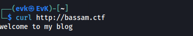  

By opening the browser and searching 
```
http://192.168.1.55:80
```
We get to an empty web page,
  
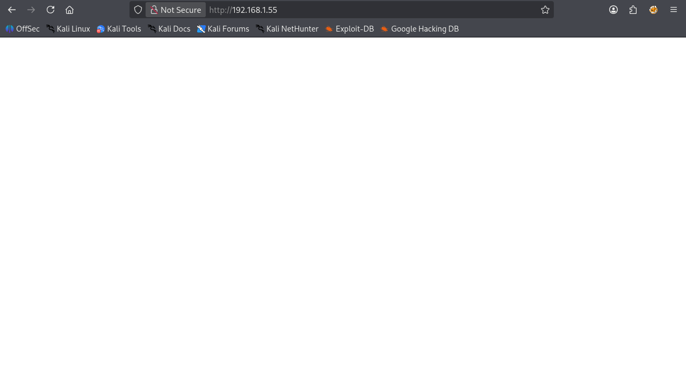  

Intuitively I now decide to explore the bassam.ctf website in the browser: 
```
http://bassam.ctf/
```
We get to a white page that welcomes us to the main blog "Welcome to my blog".
  
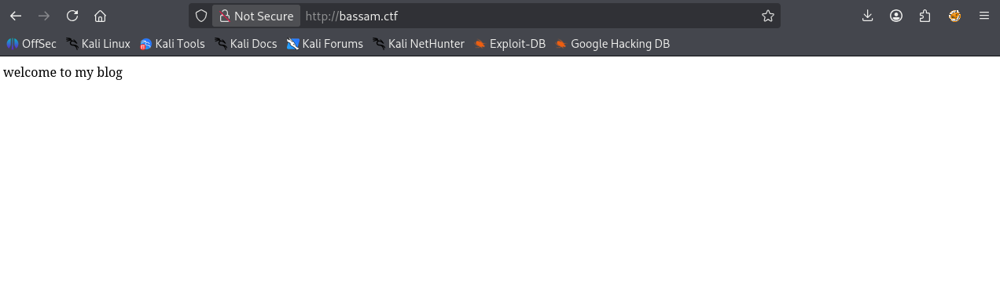
  
Here I decide to choose the path to try to find other possible subdirectories and go deeper in the enumeration.  
I open gobuster and run a search on the possible existing subdirectories.
```
gobuster dir -u http://bassam.ctf -x php,lua,hmtl,txt -w "wordlist.txt"
```  

While I was hopeful to find existing subdirectories that would give me a clear path, no subdirectories were found other than "index.html".
  
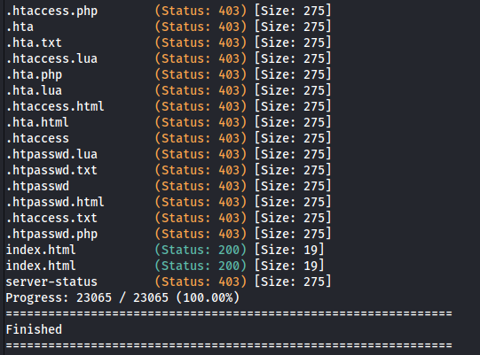  
  
Feeling a bit lost with no clear path to follow, I decide to take make two choices:
- Run a vulnerability scan with nmap.
- Run a subdomain scan with ffuf on the bassam.ctf domain.

Starting with the vulnerability scan:
```
nmap 192.168.1.55 -sV -sS -p22,80 -T4 --script vuln
```
A huge list of possible exploits comes out, requiring some time to research them, of course in order of how severe they are.
  
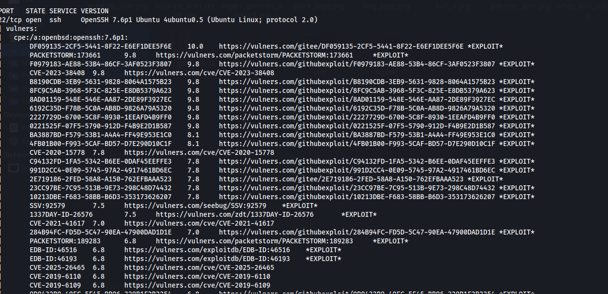  

In this very moment I thought that there would be more to a blog than just a welcoming page.

Here I run the Vhost discovery with ffuf.
```
ffuf -u http://bassam.ctf -H "Host: FUZZ.bassam.ctf" -w wordlist.txt -fc 404
```
  
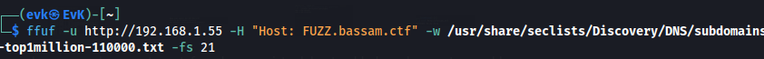
  
And very positively I get a result that there is a subdomain called "Welcome".
  
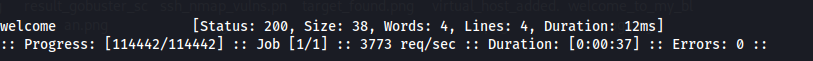

I immediately add it in the /etc/hosts file.
  
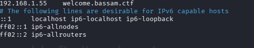

And open the new web page at:
```
http://welcome.bassam.ctf
```
On the web browser, being welcomed, once again, to an empty page.  
I immediately decide to inspect the page and see a comment that says "Open your eyes".
  
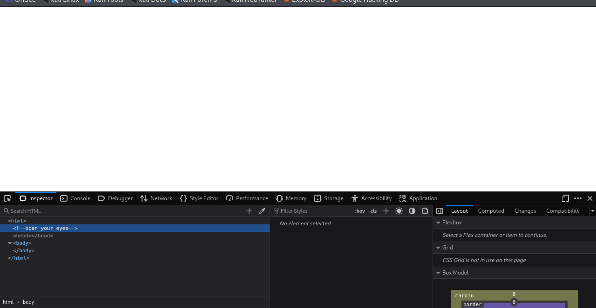
  
Another gobuster search for subdirectories, same as before (but of course changing the target to be "welcome.bassam.ctf), reveals two php files available, good enumeration always comes in handy.
  
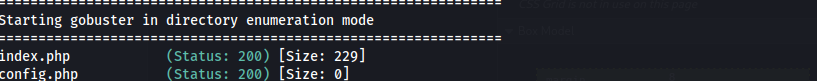
  
These websites are not what I expected them to be.
Config.php was empty, but index.php revealed to be an interesting page.
Upon opening "http://welcome.bassam.ctf/index.php we are welcomed by a white page with an input box and a "download" button. After trying to run commands and download files (which did not work) I decide to type "config.php" and press enter, and this surprisingly downloaded the config.php which we could not inspect before in the browser.
  
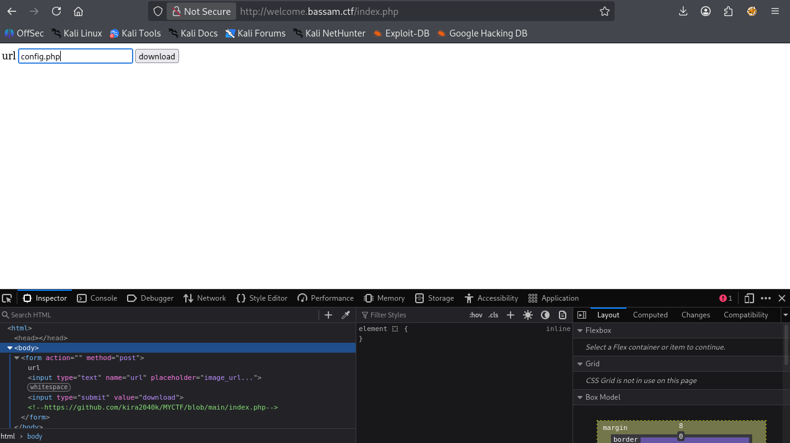

Upon opening, the file revealed a username and password, giving me a path to try in port 22 for the SSH service to establish a connection with the machine.
This is a common misconfiguration where developers leave database 
credentials in publicly accessible files.
  
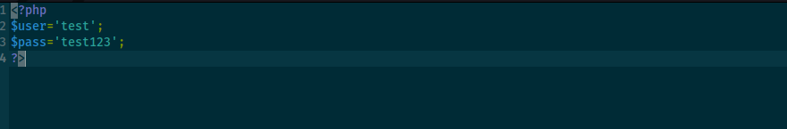

Now by 
```
ssh test@192.168.1.55
```
We are able to login into ssh by inputting the given password (test123).  
I kind of regretted not bruteforcing here.  

The connection is now successful, and we are in the machine as user Test.
  
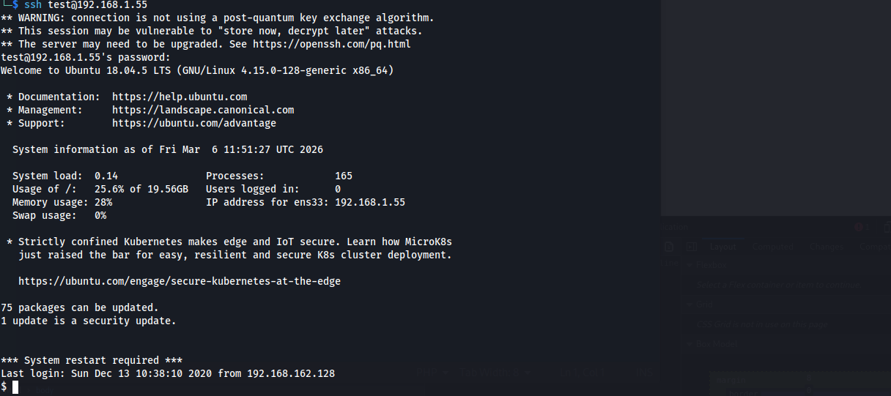

The privilege escalation part to root starts.  
Here I immediately start with some enumeration to understand which permissions I have and what the OS/Kernel versions this target machine has.
  
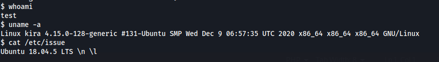  

Some research on these versions does not really show immediate exploits, so I decide to move onto the system exploration, and list all the files and hidden files in the test directory by:
```
ls -la
```
  
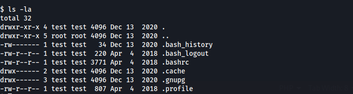

I also run 
```
sudo -l
```
To see my current privileges.
  
After some bottomless system exploration, I see a "PassProgram" folder in the root folder.
  
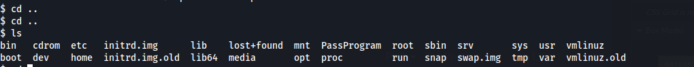
  
This folder contains an encoder and decoder, which will be probably useful for a password or text of some kind.  
After some more system digging, I reach the "var" folder, and see a "MySecretPassword" file, which I decode using the previous decoder 
  
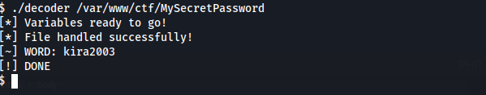

An important detail is that during my exploration, I found three users:
- test
- kira
- bassam
So I assume this password is for either kira or bassam.
```
Username: kira
Password: kira2003
```
  
After trying it for kira, I managed to switch user and go one level deeper.
  
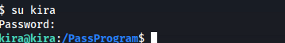

In kira I immediately run "sudo -l" again and we can now see some files that we can run, one of them is "test.sh".  
  
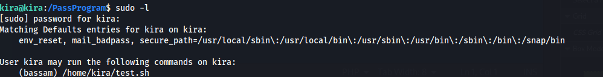
  
This is the part of this escalation that took me the longest.  
What this file does, is that it executes a command as bassam, therefore i run:
```
sudo -u bassam ./test.sh bash
```
The script has unquoted variable expansion: 
        ./test.sh runs: echo $name
        By passing 'bash', we inject bash as a command
        Vulnerable line: echo $name (should be echo "$name")
  
We now run sudo-l and see that we are in fact now bassam, and that we can execute down.sh as root, one level closer to root.
  
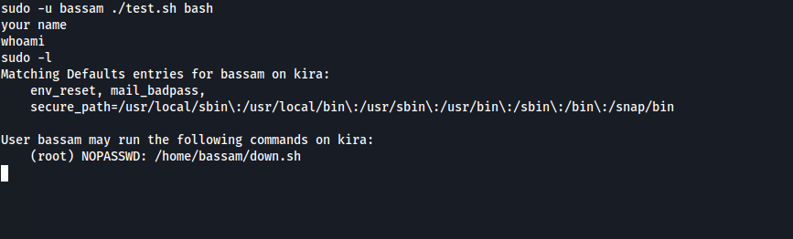
  
By catting this down.sh file, we discover our way to root this machine.
  
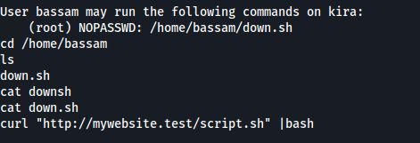

What this file does is it curls at "http://mywebsite.test/script.sh" and executes it as root.  

The solution I found is to create an identically named malicious file and somehow make it execute from this bash.  
Very important is to note that the file is executed by the "mywebsite.test" host, so we need to check the hosts of the target machine and update them adding this mywebsite.test and link it to our IP address. So the target machine will execute this file from our machine.
  
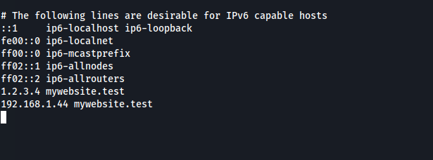
  
Moving to our machine, I create a script.sh that should technically launch a bash as root.
```
echo '#!/bin/bash' > script.sh
echo '/bin/bash -p' >> script.sh
```
when script.sh is run by a privileged process, /bin/bash -p spawns a bash shell that preserves the elevated privileges (-p disables the effective UID reset). This is a common technique when you find a writable script that gets executed as root.

This didn't work because curl pipes to bash in a non-interactive context, so /bin/bash -p exits immediately. A reverse shell creates a persistent TCP connection, giving us an interactive root shell.  
  
I use netcat on my attacking machine to listen to port 8090.
```
nc -lnvp -8090
```
And I edited my script.sh to spawn a reverse shell to port 8090.  
The setup can be fully seen down here.
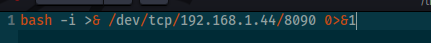 Reverse shell in script.sh
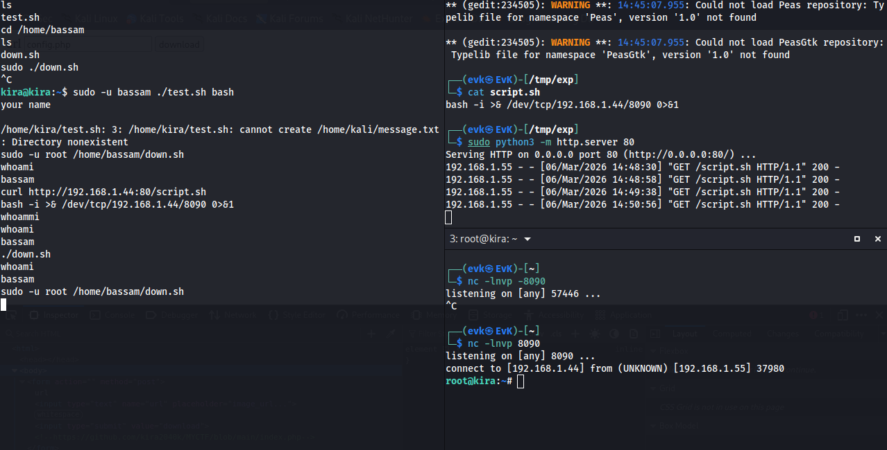 Reverse shell setup  

And just like this, we can see that we are now root in the target machine, reaching the end of the exploitation of this box.


