# Cybersecurity Portfolio
## Empire Breakout writeup - Local Network

After downloading and opening the box from vulnhub : https://www.vulnhub.com/entry/empire-breakout,751/, we launch it in VMware and log into our main machine.  

First things first, we open our cmd and start with a ping sweep to get an idea of who is alive on our network without causing too much network noise.
  
```
nmap -sn 192.168.1.0/24
```  

  
As the target machine is on the local network, it is easy to identify, thanks to also the host name being "VMWare"  
Here we acquire the important information that our target is located at the IP: 192.168.1.54.  
  
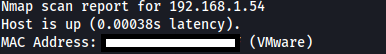  

Finally we can run a more targeted scan on the target IP.
  
```
nmap -sS -sV -p- -T4 --open 192.168.1.54
```  
This nmap scan shows which ports are open and which services/versions are running on these ports.
  
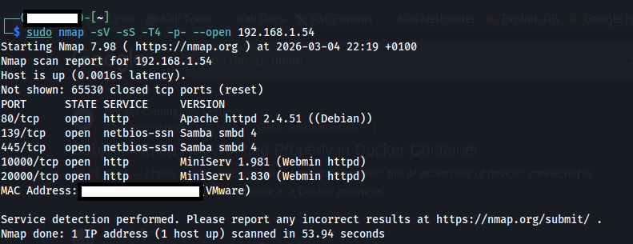 

The ports that are open and the services running on the target machine are:
- 80: running http, more specifically Apache 2.4.51
- 139/445: Samba smbd 4
- 10000: Miniserv 1.981
- 20000: Miniserv 1.830  
Immediately from the result of the scan we can have an idea of the enumeration and possible exploitation approach.

My approach start from enumerating port 80, and if nothing is found proceed to SMB, which usually is one of the most common entry points, if nothing is found, then bruteforcing/exploiting the web server on ports 10000/20000 is an idea.  

Starting with port 80, I open the browser and check against any useful information.  
```
http:192.168.1.54:80
```
Here I am welcomed by a default Debian page, which, apart from hinting to poor hygiene, does not reveal much, other than confirming the debian 1.4.51 version given by nmap.  

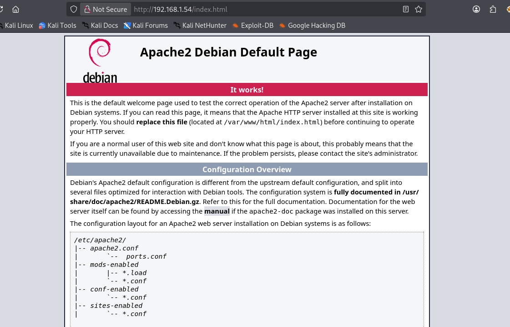  
  
I decide to go further with the web page enumeration and open gobuster trying to find subdirectories.
```  
gobuster dir 192.168.1.54 -w /usr/share/wordlists/dirb.common.txt
```  
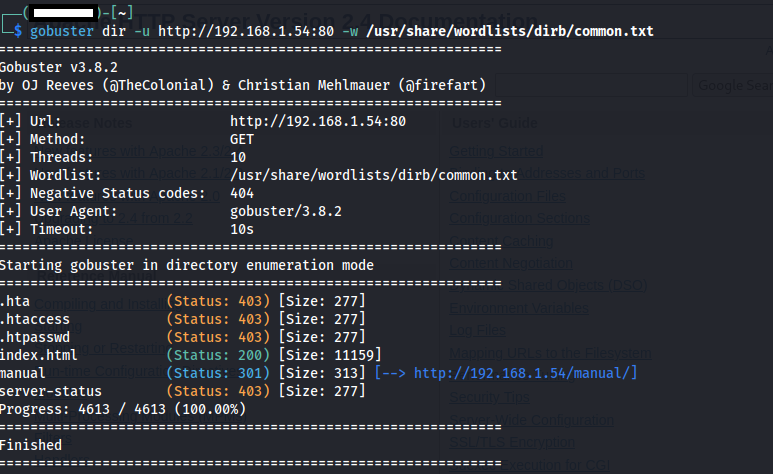

The result does not give much direction, revealing a manual page and the index.html page.
```
http://192.168.1.54:80/manual
```  
Certain that I would not find much, I navigate to the manual page, where I, in fact, see only the default Debian manual.
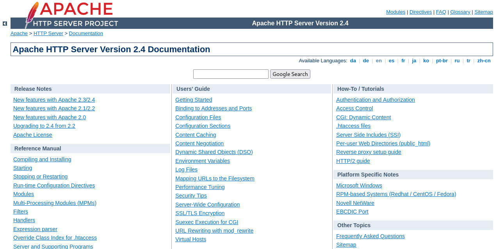  

After trying different wordlists, I did not find any interesting subdirectory.  
Before moving on to SMB and port 139/445, I decide to see the headers and body of the connection with the web page, and run a curl on the website.  
```
curl -i 192.168.1.54:80
```
Which holds a "brainfucked encoded" string to the end, possibly a password or username.  
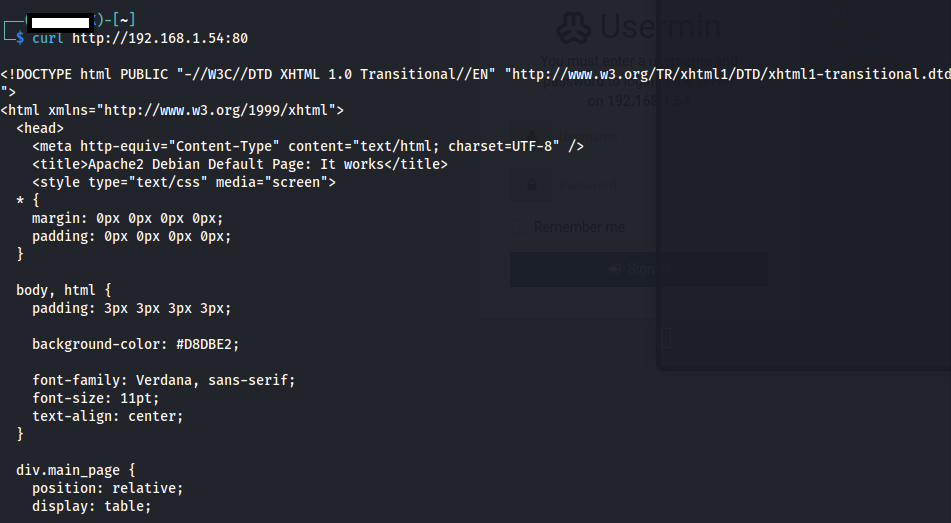  
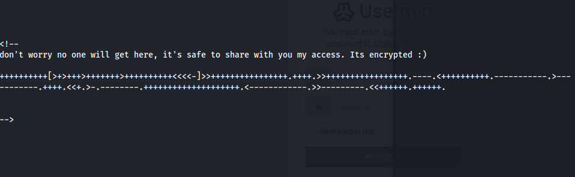  

I decode the password in the online tool dcode, obtaining what it seems to be a decrypted password.
```
Password: .2uqPEfj3D<P'a-3
```
Now that we have a password we can proceed to the SMB ports.  

I start to enumerate the SMB ports using smbmap, a go-to tool for a first mapping of the SMB implementation in the target machine.   
```
smbmap -H 192.168.1.54
```  
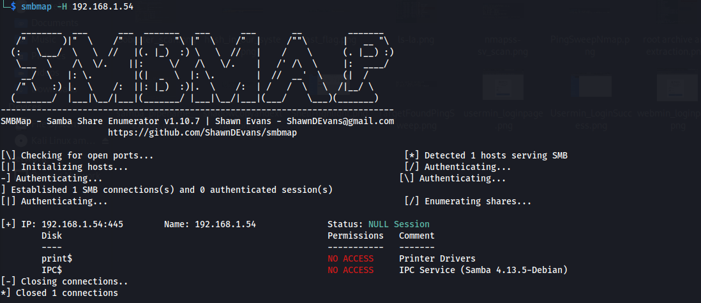  
A straightforward output gives us the valuable information that two sessions are opened in the target machine SMB service, both with no access permission.
```
IPC
print
```  
After noting down the Samba 4.13.5 version, I decide to move on and run enum4linux for a more detailed overview of the situation, while at the same time searching for Samba 4.13.5 on metasploit to see whether there are available exploits.  
```
enum4linux -a 192.168.1.54
```  
Enum4linux comes back with information of great value, two domains are present on the target machine:
- Breakout
- Builtin
We also see that the target machine allows for sessions using username and password.
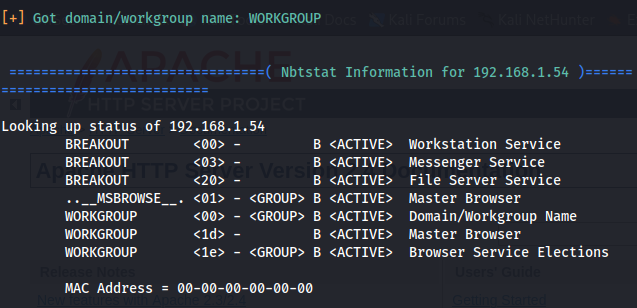

The biggest find is definitely that the enum4linux lists the Unix user of the target machine: 
```
cyber
```
This could hint to a potential username, granting us a possible login in one of the two ports that host the web service service.
  
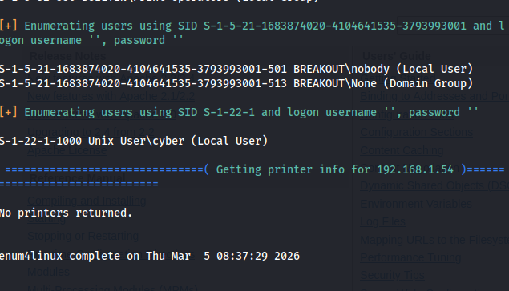
  
Not as fortunate, the search for Samba 4.13 did not bring much information, listing a possible pipe exploit, which would turn out to be a maybe too complex and unstable solution, as well as having requirements that we are not sure are being met.  
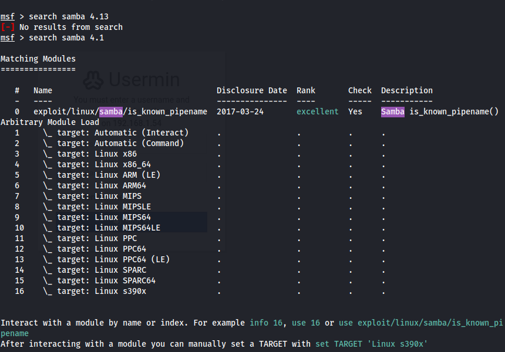 
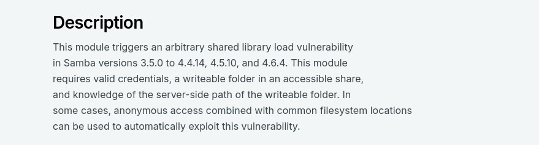  

Having a possible username and password combination, I decide to move onto port 10000 and 20000.
```
cyber
.2uqPEfj3D<P'a-3
```
Port 10000 and Port 20000 are the default ports for two related web-based administration tools, Webmin and Usermin.  
This is most likely where we will be inputting our username and password.  
Given that we also have the specific version of the services  
```
10000 Webmin 1.981
20000 Usermin 1.830
```  
I decide to run Nuclei as well, which comes back with no obvious exploits for these two versions of the web services.  

I open both the pages, and see the two Usermin and Webmin login forms.  
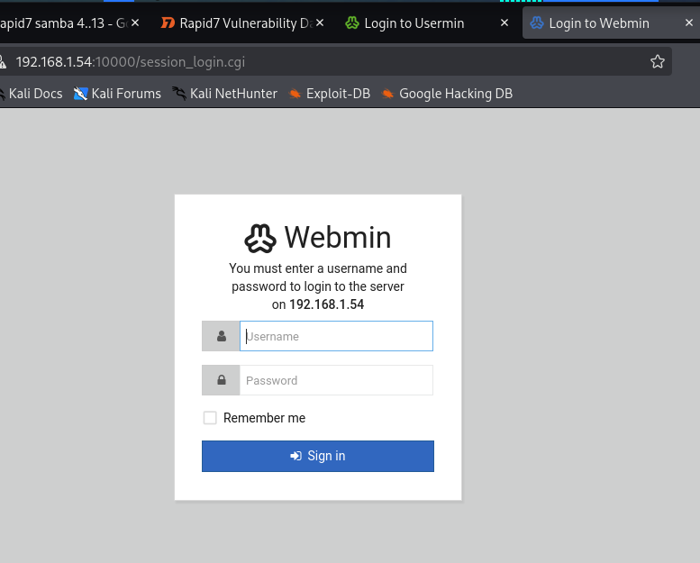
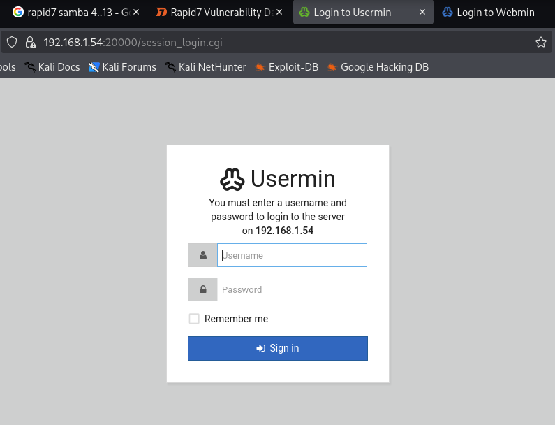  

On the Usermin page I try:  
```
Username: cyber
Password: .2uqPEfj3D<P'a-3
```
And we are in, that was not too bad!  

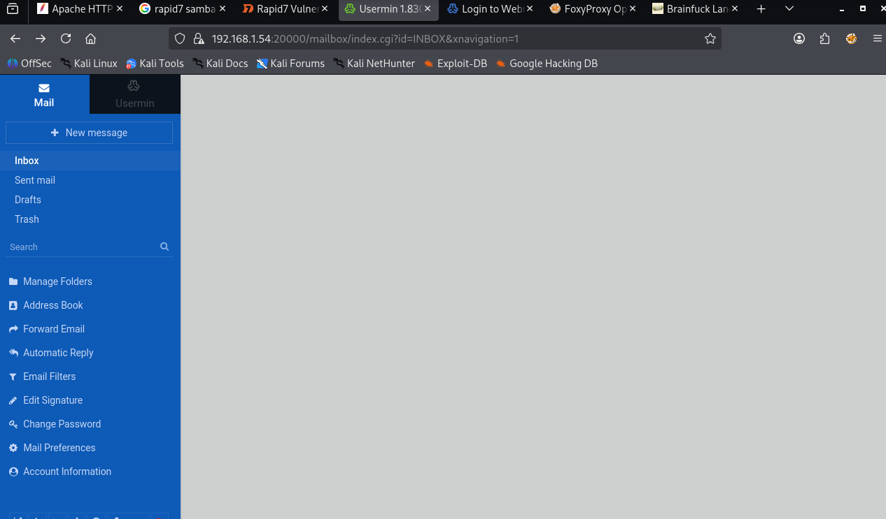  

Here I started exploring a bit before opening the shell given by Usermin (icon located at the bottom left of the page).  

After clicking there, we have a console under the privilege of cyber.  
Here we run the common linux commands to have a rough idea of the access possibilities in this machine.  
```
whoami current user
cat /etc/issue/ linux OS
uname -a linux kernel
```  
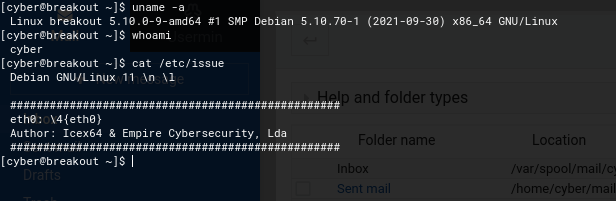  

We now have an overall idea of the environment we are in, and we can start with the privilege escalation process.  
I decide do run ls -la to list all the files present in the cyber workspace.  
```
ls -la
```
This is where we find two interesting files:  
```
tar
user.txt
```  
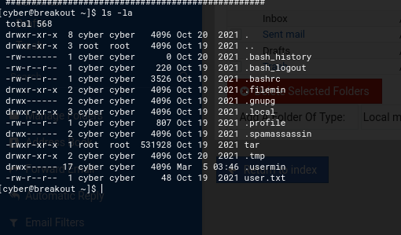  

We cat the user.txt to obtain the first flag.
```
cat user.txt
```

Now for the final part, we need to be able to reach root level access, and tar is most likely our way to do it as it has root level execution, allowing us to copy the entire root directory or the shadow directory and view the hashed passwords, and therefore crack them.  
My first objective here is to get the root flag, and I will try to do it using a file exfiltration technique.
I use tar to archive and extract all the root directory in the target machine's tmp folder.  
```
sudo tar -cvf /tmp/archive.tar /root/
tar -xf /tmp/archive.tar -C /tmp/
```  
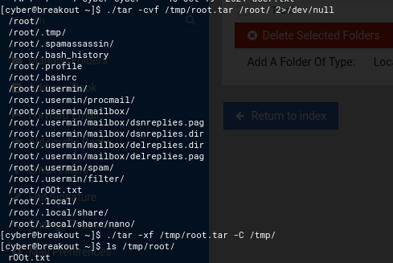  

Here now i can obtain the root flag
```
cat rOOt.txt
```  
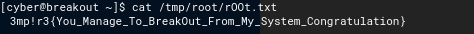  

Despite the achievement of the objective, I wanted to practice more exfiltration, and copied /etc/shadow as well to obtain the hash of root, following a similar method to the one with root.

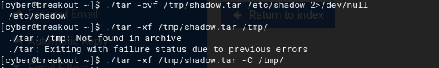  

```
sudo tar -cvf /tmp/archive.tar /etc/shadow
tar -xf /tmp/archive.tar -C /tmp/
cat /tmp/etc/shadow
```  
Finally by doing 
```
cat /tmp/etc/shadow
```
We see all the hashes.
  
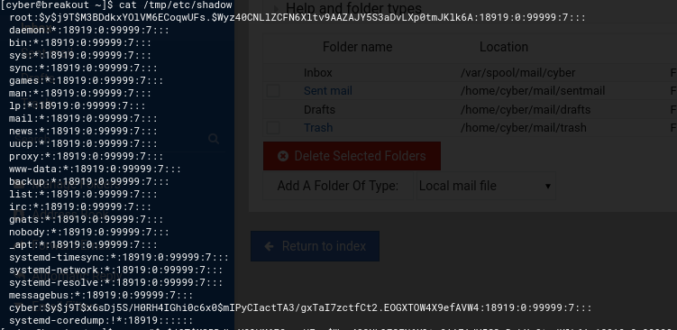  

I decide to copy the root password and paste it in my attacker machine using gedit.  
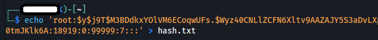
  
Here I use John the Ripper and rockyou.txt to bruteforce the hash, which, due to hardware and time constraints, would have taken too long to crack.

And here ends our journey in hacking this box!
Hope this was useful!


