# Cybersecurity Portfolio
## Hackathon2_CTF writeup - Local Network

This is one of the many guidelines for this lab, definitely not the best one due to a peculiar negligence from my side.  
Let's start.  
  
After downloading and opening the box from vulnhub : https://www.vulnhub.com/entry/hackathonctf-2,714/ , we launch it and log into our machine.  
  
Here we run a TCP null scan on the network.
```  
nmap -sN 192.168.1.0/24 
``` 

From the result of the scan, I immediately understood that the target machine was at IP 192.168.1.52 as the host was VMWare.
  
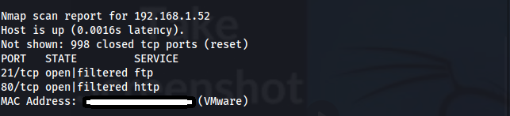  

It is now possible to enumerate more accurately the target.

Here I usually scan with both Nessus and then nmap, but this time, I decide to scan only with nmap due to the lower complexity of the lab. Here I neglect something that will cost me some time later.
```bash
nmap -sS -sV -T4 192.168.1.52 --open
```  
Where --open prints hosts/ports that are not definitively closed.
  
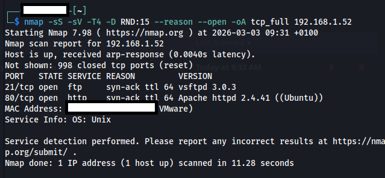
  
The scan shows that port 21 and port 80 are open, with respectively
- Port 21 runs FTP using usftpd 3.0.3.
- Port 80 runs http using Apache httpd 2.4.41 on Ubuntu.
  
My first idea is to first try to connect to FTP for a quick test.
```bash
ftp 192.168.1.52
```
Here I use the username: anonymous and the password: admin.  
And against my expectation, we are in, so anonymous login was left open.  
I immediately run an "ls" to see what files are available through ftp.

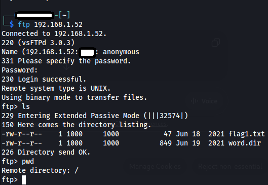
  
Here we see two files available "flag1.txt" and "word.dir", which I immediately get by running the known ftp commands.
```bash
get flag1.txt
get word.dir
```
  
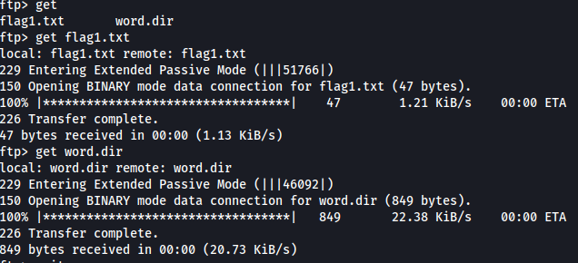
  
I also try to upload a temporary text.txt file, but upload of file was disabled.
  
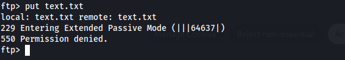
  
I open flag1.txt, which contains an md5 encrypted text, which I decided to decrypt through crackstation.  
The decrypted text was equal to "doBash".  
We officially obtained the first flag!
  
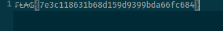


Now we open word.dir, which is definitely more interesting, and contains a list of passwords, probably to use later, with hydra, for some sort of login service.
  
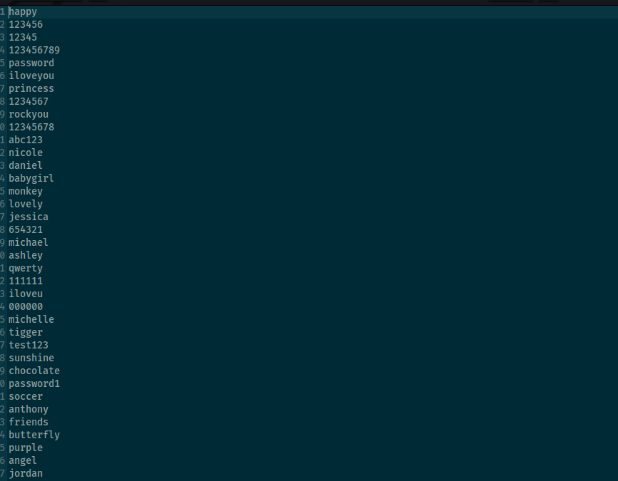

At this point, I went over to the next available port: 80 with http. 
I open my browser and type:
```bash
http://192.168.1.52:80
```
And we are now in the web page, which does not contain much.
  
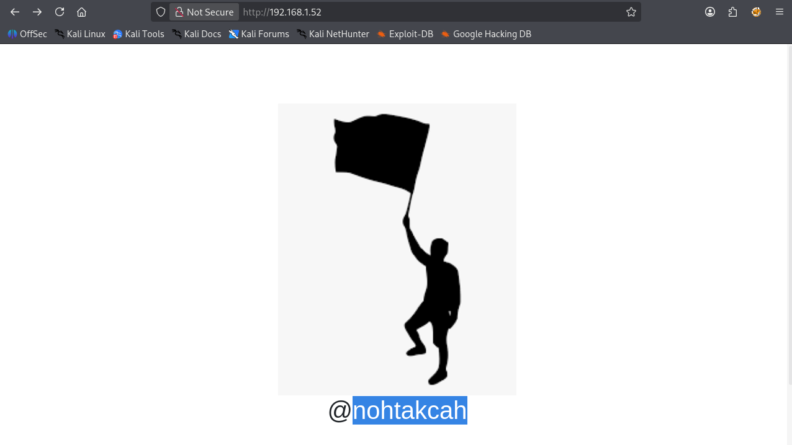
  
Here, with web pentesting, we have different tools in our hands.  
I decide to run gobuster to check if there are subdirectories using the dirb/big_wordlist using the command  
```
gobuster dir -u http://192.168.1.52:80/ -w /usr/share/wordlists/dirb/big.txt
```
And obtained some interesting results.  
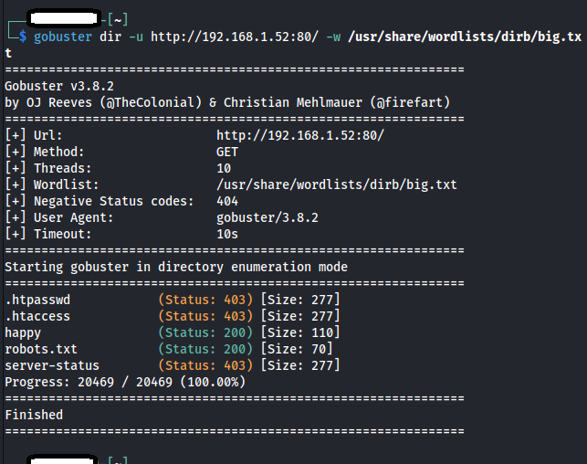

I open robots.txt in the webpage.  
```bash
http://192.168.1.52:80/robots.txt
```
Which does not contain interesting text, even inspecting with the browser inspection tool.

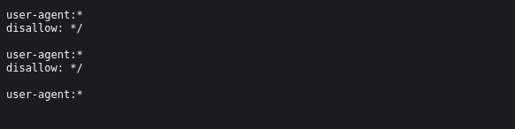

I then decide to open the "happy" page, which, on the other hand, proves to be very interesting.  

```
http://192.168.1.52:80/happy
```
The page really deceivigly says that "Nothing is here", but after browser inspection, we notice that a comment gives out the username: hackathonll. 

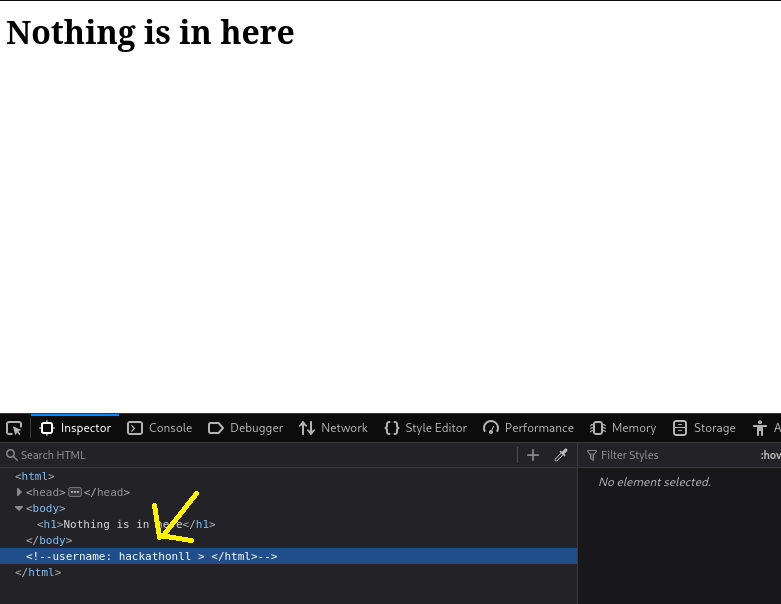  

Confused on the absence of a login page or login service, after way too many minutes I realise that my first scan was not complete and decide to run a full port scan with nmap.
```
nmap -p- -T4 192.168.1.52
```  
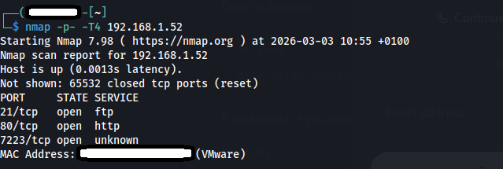
  
Which reveals port 7223 open, where OpenSSH is running.  
We have a username and a list of passwords, so it is time to bruteforce with hydra.  
```
hydra -l hackathonll -P word.dir 192.168.1.52 -s 7223 ssh
```
Which returned a positive result.
  
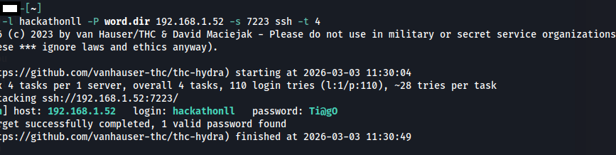

Username: hackathonll Password: Ti@gO

I SSH successfully and run some enumeration to start thinking about the Privilege Escalation section to be able to root into the machine, so I decide to run some commands to see the OS and linux Kernel, not finding any exploits for them.  
```
cat /etc/issue
uname -i
```  
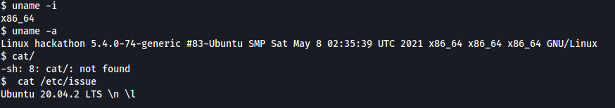

Finally I run sudo -l and to my surprise I see that /usr/bin/vim can be sudoed without being root.
  
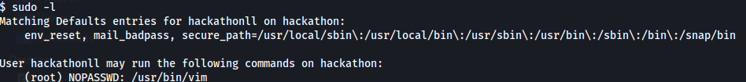
  
We proceed by running the following command:  
```
sudo /usr/bin/vim
```  
And from the vim we can escalate to root.  
When we exit vim, we can execute commands, such as :wq to exit and save, :q to quit etc...  
So by running :!/bin/sh, we run an interactive shell session from within vim, where we can run any prompt normally...  
  
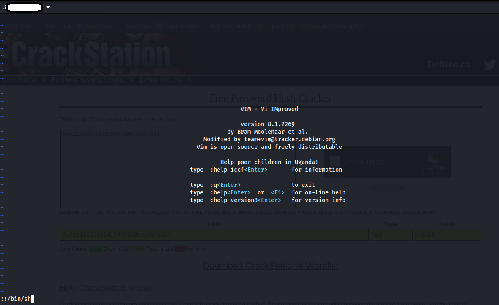
  
We therefore now can verify our current privilege and cat /root/flag2.txt  
```bash
whoami
cat /root/flag2.txt
```  
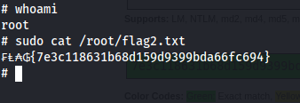  

This marks the end of this box, which has reminded me to follow the most important rule of pentesting, good enumeration is essential not to get lost later on.


